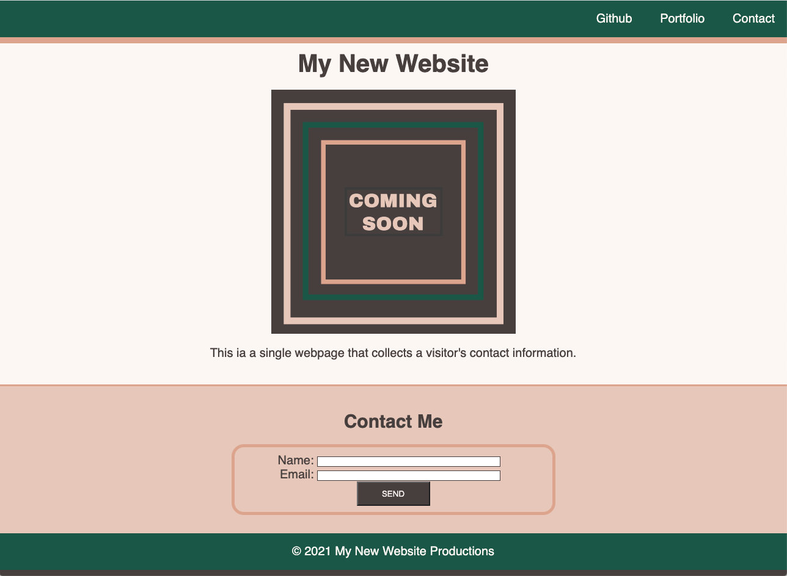

# <Basic-Landing-Page>

# Basic Landing Page

## Summery
This project is about a simple web-page that collects a visitor's contact information.

A landing page that have:
*  a header and footer.
*  an image with a caption.
*  contact form.

## Built with

* Website crated With HTML language.
* Add custom styling with CSS framework.

* [HTML](https://developer.mozilla.org/en-US/docs/Web/HTML)
* [CSS](https://developer.mozilla.org/en-US/docs/Web/CSS)

## Link
You can experience the deployed project here: [Basic Landing Page URL]().

## The following demo shows the web application's appearance and functionality:

## Refer to the documentation:

* [MDN Web Docs on font](https://developer.mozilla.org/en-US/docs/Web/CSS/font)

* [MDN Web Docs on HTML section heading elements](https://developer.mozilla.org/en-US/docs/Web/HTML/Element/Heading_Elements)

* [MDN Web Docs on how to structure a web form](https://developer.mozilla.org/en-US/docs/Learn/Forms/How_to_structure_a_web_form)

* [MDN Web Docs on the button element](https://developer.mozilla.org/en-US/docs/Web/HTML/Element/button)

* [MDN Web Docs on the figure element](https://developer.mozilla.org/en-US/docs/Web/HTML/Element/figure)

